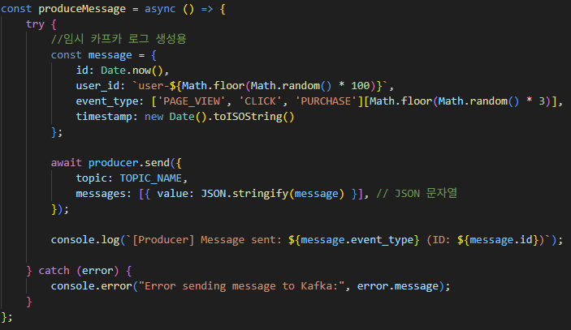
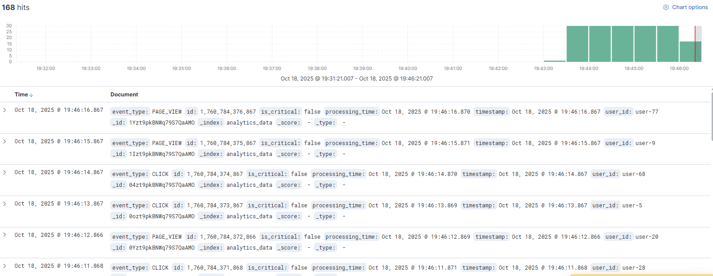
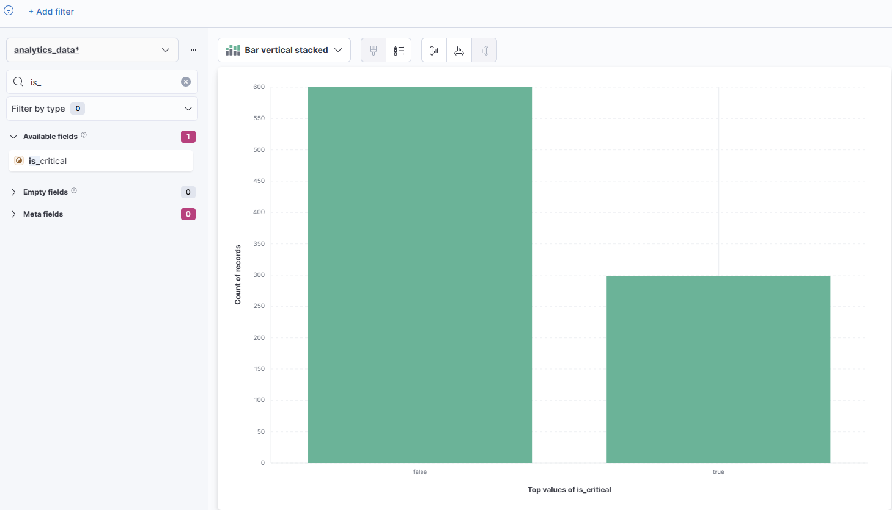
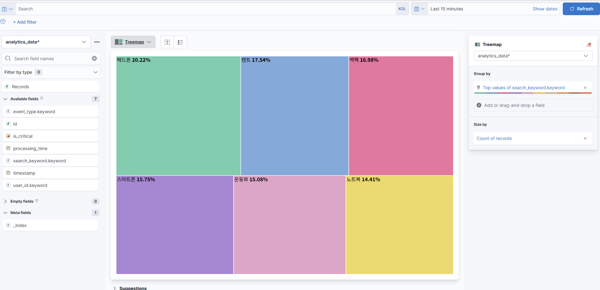

# 실시간 이벤트 분석 시스템

#### **프로젝트 소개**

**Node.js와 Kafka, Elasticsearch, Kibana(ELK)** 스택을 활용하여 대규모 사용자 행동 로그를 수집하고, 실시간으로 분석/시각화하는 시스템

---

#### **문제 해결 전략**

**대규모 데이터 처리 및 분석** 문제 해결 전략

-   **과부하 문제**: API 서버의 지연을 해결하기 위해, 이벤트 생성(Producer)과 데이터 처리(Consumer)를 분리하는 **비동기 파이프라인** 구축(**Kafka** 활용)
-   **처리량 문제**: Consumer가 데이터를 하나씩 처리하는 비효율을 해결하기 위해, **Elasticsearch Bulk API**를 활용하여 **배치(Batch)** 단위로 전송


---

#### **시스템 아키텍처 및 기술 스택**

| **기술** | **역할** | **이유** |
| :--- | :--- | :--- |
| **Node.js & Express** | Producer/Consumer | **비동기 I/O**를 활용 |
| **Kafka** | 메시지 브로커 | 대규모 이벤트 로그를 **안정적으로 수집** |
| **Elasticsearch** | 분석 엔진 | 실시간 데이터 **분석** |
| **Kibana** | 데이터 시각화 | Elasticsearch 데이터를 활용하여 **실시간 트래픽 추이 및 이벤트 분포** 확인 |
| **Docker Compose** | 환경 컨테이너화 | **분산 서비스 환경**을 단일 명령으로 쉽게 구축 및 관리 |
| **Docker** | 컨테이너화 | **Producer, Consumer, Node설정**을 컨테이너 기반으로 구축 |

---

#### **기능 구현**

1.  **Phase 1: 실시간 이벤트 수집 및 분산 (Producer)**
    -   **문제**: API 서버 대용량 처리
    -   **해결**: Node.js **Producer**가 `analytics_events` 토픽에 이벤트를 발행 ->  시스템 부하 최소화

2.  **Phase 2: 데이터 전처리 및 최적화 (Consumer)**
    -   **문제**: 낮은 처리량
    -   **해결**: Node.js **Consumer**가 Kafka 메시지를 읽어온 후, **Bulk API**를 사용해 Elasticsearch에 적재 -> **처리량 최적화** 

3.  **Phase 3: 실시간 모니터링 대시보드 (Kibana)**
    -   **문제**: 실시간 데이터 시각화
    -   **해결**: **Kibana**를 통해 `analytics_data` 인덱스 기반의 **트래픽 대시보드**를 구축 -> 실시간 이벤트 현황 모니터링

---

#### **STEP BY**
1.  **인프라 컨테이너 실행**
    ```bash
    # 전체 환경 실행 
    docker compose up --build -d
    ```

2.  **로그 검증**
    -   각 컨테이너의 로그를 통해 데이터의 흐름과 처리 상태를 검증
    ```bash
    # 터미널 1: Producer (데이터 생성/발행 확인)
    docker logs -f node-producer

    # 터미널 2: Consumer (데이터 처리/적재 확인)
    docker logs -f node-consumer
 

3.  **테스트 및 결과 확인**
    - 1초에 한번씩 더미데이터 생성 (Producer 로그 확인)
    

  - 브라우저에서 `http://localhost:5601` (Kibana) 접속

  - **Stack Management**에서 `analytics_data` Index Pattern 생성 후, **Discover** 탭에서 실시간 이벤트 목록 확인
    

  - **Visualize** 탭에서 트래픽 및 이벤트 분포 차트를 생성하여 최종 분석 결과를 확인
    

  - **키워드** 추가해서 키워드로 분석 결과 확인
    